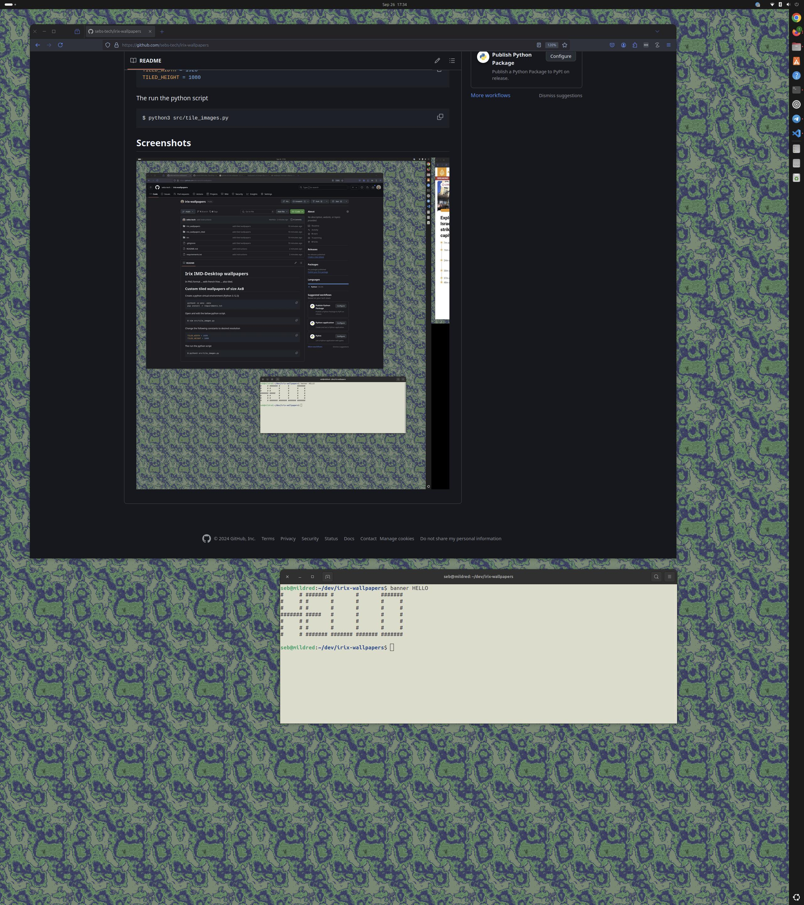

# Irix IMD-Desktop wallpapers

In PNG format ... with french fries ... also tiled. 

## Custom tiled wallpapers of size AxB

Create a python virtual environment (Python 3.12.3)
```bash
$ python3 -m venv .venv 

$ sudo apt install python<ver>-venv (Ubuntu)

$ source .venv/bin/activate 
$ pip install -r requirements.txt
```

Open and edit the below python script. 
```bash
$ vim src/tile_images.py
```

Change the following constants to desired resolution
```python
TILED_WIDTH = 1920
TILED_HEIGHT = 1080
```
Then run the python script 
```bash
$ python3 src/tile_images.py
```

The tiled wallpapers will be in: 

```bash
$ cd irix_wallpapers/* 
``` 

## Screenshots

